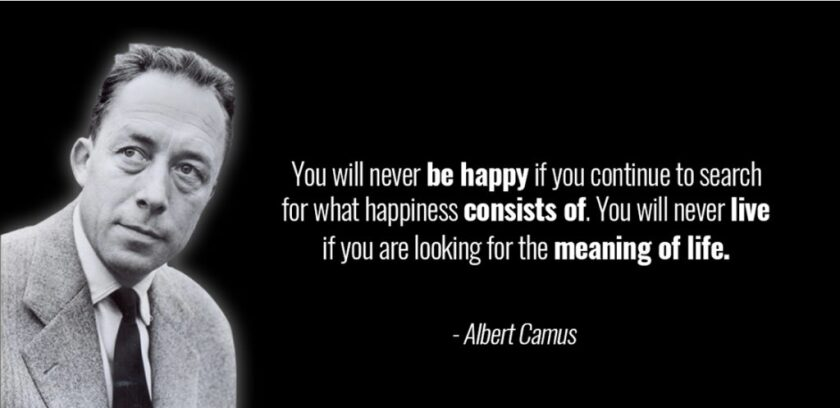

# Randomness Rules Again

Looking at my past two days' production of motion graphics, I realized that they were both compositions of political figures with things emerging from their heads. With that in mind 😅 I'll be getting back to what I do best: absurd randomness.

Life is a miracle and there is no purpose to existence. Consciousness is an illusion and we never see truth. You know, I'll be touching on lighthearted themes like that over the next few sessions.

This is mostly a freestyle collage of whatever came to mind with a time limit of two hours. I wanted to experiment with the old school style of titling. Jet fighters and muppets feature broadly.

